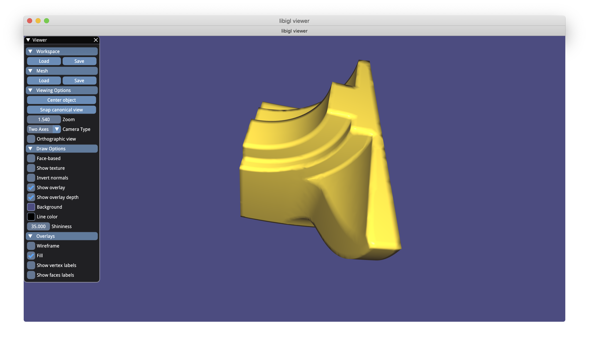
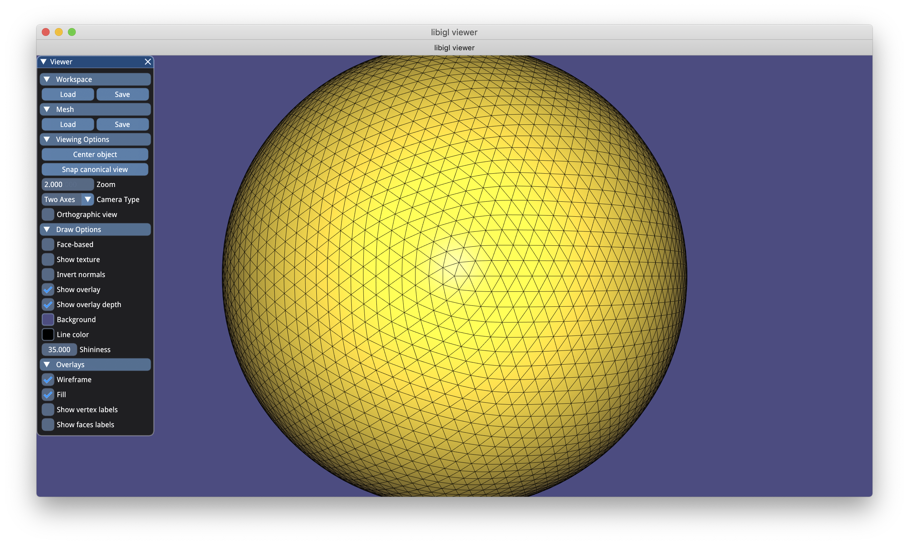

# Assignment 1

Daniil Emtsev ETH Zurich

There is a first assignment covering basic operations with objects and visulisation.

<!-- TABLE OF CONTENTS -->
## Table of Contents
* [Data Structures for the plane](#data-Structures-for-the-plane)
* [Shading with fundisk](#Shading-with-fundisk)
* [Connected components](#Connected-components)
* [Subdevided meshes](#Subdevided-meshes)
* [Summary](#Summary)

## Data Structures for the plane

### Vertex to Faces data structure:

| Id of the vertex  | Id of adjacent faces |
| ------------- | ------------- |
|0|5  21  |
|1|31  |
|2|10  26  |
|3|0  |
|4|14  27  30  |
|5|13  23  29  |
|6|1  4  17  |
|7|2  8  18  |
|8|6  9  12  19  22  25  |
|9|15  30  31  |
|10|11  26  27  |
|11|7  21  23  |
|12|15  29  31  |
|13|4  5  20  |
|14|0  1  16  |
|15|8  10  24  |
|16|0  2  16  |
|17|3  8  9  18  19  24  |
|18|3  4  6  17  19  20  |
|19|7  12  13  22  23  28  |
|20|11  12  14  25  27  28  |
|21|1  2  3  16  17  18  |
|22|5  6  7  20  21  22  |
|23|9  10  11  24  25  26  |
|24|13  14  15  28  29  30  |

## Vertex to vertexes structure
| Id of the vertex  | Id of adjacent vertexes |
| ------------- | ------------- |
|0|11  13  22  |
|1|9  12  |
|2|10  15  23  |
|3|14  16  |
|4|9  10  20  24  |
|5|11  12  19  24  |
|6|13  14  18  21  |
|7|15  16  17  21  |
|8|17  18  19  20  22  23  |
|9|1  4  12  24  |
|10|2  4  20  23  |
|11|0  5  19  22  |
|12|1  5  9  24  |
|13|0  6  18  22  |
|14|3  6  16  21  |
|15|2  7  17  23  |
|16|3  7  14  21  |
|17|7  8  15  18  21  23  |
|18|6  8  13  17  21  22  |
|19|5  8  11  20  22  24  |
|20|4  8  10  19  23  24  |
|21|6  7  14  16  17  18  |
|22|0  8  11  13  18  19  |
|23|2  8  10  15  17  20  |
|24|4  5  9  12  19  20  |

## Shading with fundisk
Three screenshots of the 'fandisk.off' model using 'per-face shading', 'per-vertex shading' and 'per-corner shading':

### Per-face shading
1 view|   2 view  |   3 view
:-------------------------:|:-------------------------:|:----------------------------:|
 |   |   

main picture

### Per-vertex shading

1 view|   2 view  |   3 view
:-------------------------:|:-------------------------:|:----------------------------:|
 |   |   

main picture

### Per-corner shading 

threshold = 80

1 view|   2 view  |   3 view
:-------------------------:|:-------------------------:|:----------------------------:|
 |   |   

main picture 
 

threshold = 15

1 view|   2 view  |   3 view
:-------------------------:|:-------------------------:|:----------------------------:|
 |   |   

main picture 
 

## Connected components

Bumpy_cube |   Bunny   |   Coffecup 
:-------------------------:|:-------------------------:|:----------------------------:|
 |   |   

Cube |   Fandisk   |   Gargo 
:-------------------------:|:-------------------------:|:----------------------------:|
 |   |   

Honda |   Plane   |   Sphere_lo_norm 
:-------------------------:|:-------------------------:|:----------------------------:|
 |   |   

### Bumpy_cube
The number of components - 1
| Id of component  | Number of components |
| ------------- | ------------- |
|  0 |  2496 |

### Bunny

The number of components - 1
| Id of component  | Number of components |
| ------------- | ------------- |
| 0 | 27864 |

### Coffecup

The number of components - 2
| Id of component  | Number of components |
| ------------- | ------------- |
|0 | 3360|
|1 | 2304|
### Cube

The number of components - 1
| Id of component  | Number of components |
| ------------- | ------------- |
|0 | 3072|

### Fandisk

The number of components - 1
| Id of component  | Number of components |
| ------------- | ------------- |
|0 | 12946|

### Gargo
The number of components - 1
| Id of component  | Number of components |
| ------------- | ------------- |
|0 | 13500|

### Honda
The number of components - 11
| Id of component  | Number of components |
| ------------- | ------------- |
|0 | 90|
|1 | 192|
|2 | 192|
|3 | 13216|
|4 | 704|
|5 | 1088|
|6 | 1088|
|7 | 1088|
|8 | 1088|
|9 | 736|
|10 | 736|

### Plane
The number of components - 1
| Id of component  | Number of components |
| ------------- | ------------- |
|0 | 32|

### Sphere_lo_norm
The number of components - 1
| Id of component  | Number of components |
| ------------- | ------------- |
|0 | 1280|

## Subdevided meshes

### Cube
Subdevided meshes - 1 step |   Subdevided meshes - 2 step    |   Subdevided meshes - 3 step
:-------------------------:|:-------------------------:|:----------------------------
 |   |  

The finest grid:

### Sphere
Subdevided meshes - 1 step |   Subdevided meshes - 2 step    |   Subdevided meshes - 3 step
:-------------------------:|:-------------------------:|:----------------------------
 |   |  

The finest grid:
 

### Honda
Subdevided meshes - 1 step |   Subdevided meshes - 2 step    |   Subdevided meshes - 3 step
:-------------------------:|:-------------------------:|:----------------------------
 |   |  

The finest grid:
 

## Summary

In the first part I see data structures which correspond to observation.

In the second part with **Per face**, indeed, I observe the color discontinuity between neighboring faces on the curve surface. **Per vertex** shading has more smooth shading especially in the regions of sharp edges (due to averaging of neighbouring normals). In the **Per corner** case we average if the angle between two normals is less than is a treshold. At 15 we have more sharp feature lines than at 80 since we are averaging not so "vigorously".

In the third part components and faces correspond to the reality

In the forth part the number of faces becomes 3 times more with the next step of mesh refining.